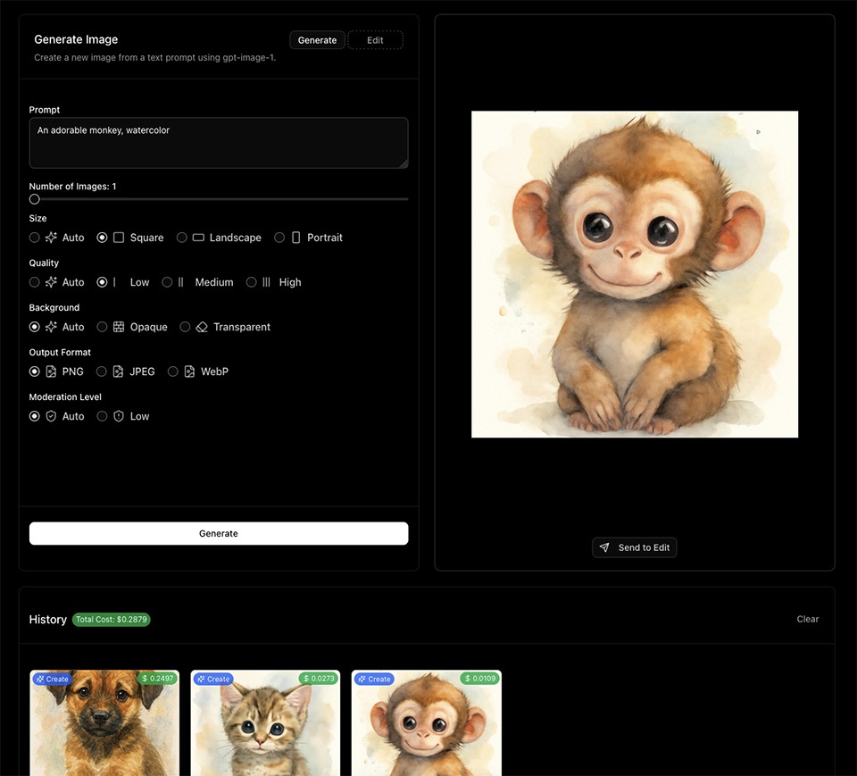
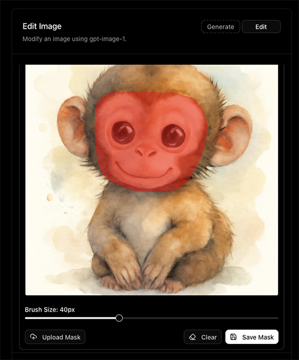
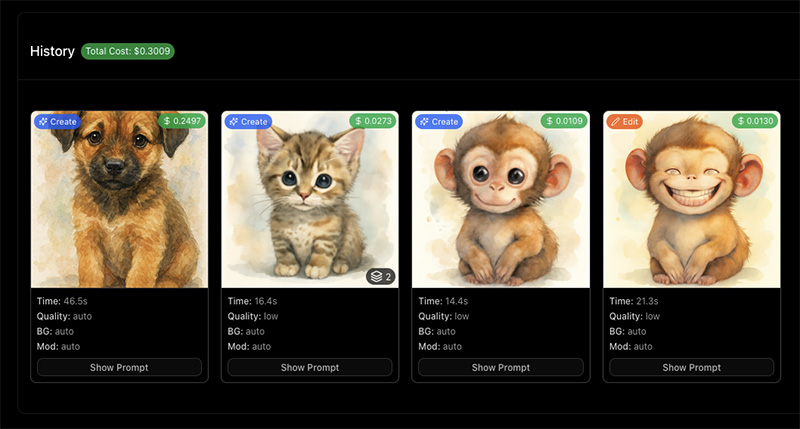
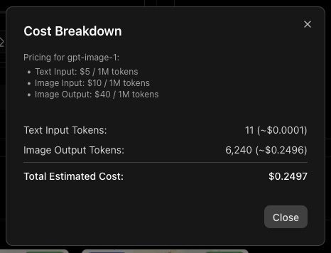

#  GPT-IMAGE-1 Playground

A web-based playground to interact with OpenAI's `gpt-image-1` model for generating and editing images.

<p align="center">
  
</p>

## ✨ Features

*   **🎨 Image Generation Mode:** Create new images from text prompts.
*   **🖌️ Image Editing Mode:** Modify existing images based on text prompts and optional masks.
*   **⚙️ Full API Parameter Control:** Access and adjust all relevant parameters supported by the OpenAI Images API directly through the UI (size, quality, output format, compression, background, moderation, number of images).
*   **🎭 Integrated Masking Tool:** Easily create or upload masks directly within the editing mode to specify areas for modification. Draw directly on the image to generate a mask.

<p align="center">
  
</p>

*   **📜 Detailed History & Cost Tracking:**
    *   View a comprehensive history of all your image generations and edits.
    *   See the parameters used for each request.
    *   Get detailed API token usage and estimated cost breakdowns ($USD) for each operation.
    *   View the full prompt used for each history item. (hint: click the $ amount on the image)
    *   View total historical API cost.

<p align="center">
  
</p>

<p align="center">
  
</p>

*   **🖼️ Flexible Image Output View:** View generated image batches as a grid or select individual images for a closer look.
*   **🚀 Send to Edit:** Quickly send any generated or history image directly to the editing form.
*   **📋 Paste to Edit:** Paste images directly from your clipboard into the Edit mode's source image area.
*   **💾 Storage:** Images are saved automatically to ./generated-images and your generation history is saved in your browser's local storage.

## 🚀 Getting Started

Follow these steps to get the playground running locally.

### Prerequisites

*   [Node.js](https://nodejs.org/) (Version 18 or later recommended)
*   [npm](https://www.npmjs.com/), [yarn](https://yarnpkg.com/), [pnpm](https://pnpm.io/), or [bun](https://bun.sh/)

### 1. Set Up API Key

You need an OpenAI API key to use this application.

1.  If you don't have a `.env.local` file, create one.
2.  Add your OpenAI API key to the `.env.local` file:

    ```dotenv
    OPENAI_API_KEY=your_openai_api_key_here
    ```

    **Important:** Keep your API key secret. The `.env.local` file is included in `.gitignore` by default to prevent accidental commits.

### 2. Install Dependencies

Navigate to the project directory in your terminal and install the necessary packages:

```bash
npm install
# or
# yarn install
# or
# pnpm install
# or
# bun install
```

### 3. Run the Development Server

Start the Next.js development server:

```bash
npm run dev
# or
# yarn dev
# or
# pnpm dev
# or
# bun dev
```

### 4. Open the Playground

Open [http://localhost:3000](http://localhost:3000) in your web browser. You should now be able to use the gpt-image-1 Playground!

## 🤝 Contributing

Contributions are welcome! Issues and feature requests, not as much welcome but I'll think about it.

## 📄 License

MIT
